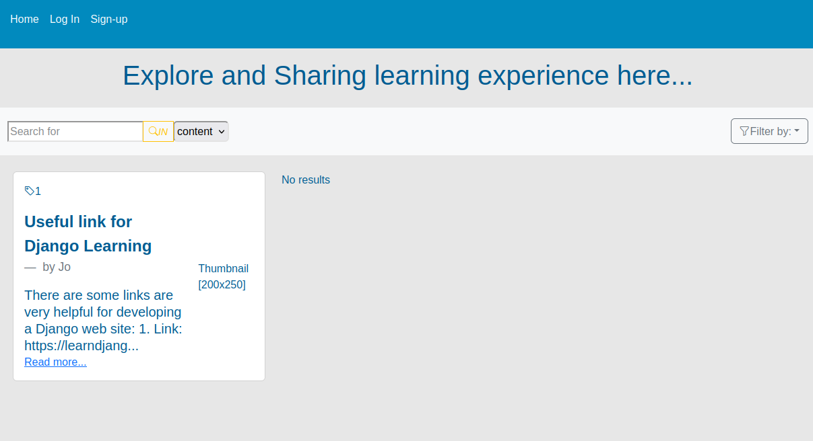

# Getting Started with lba-r App

This is a full stack project with django-rest-framework as backend and react as front-end.

---lba stands for: learning blogs app; 
----r stands for: react as front-end; 

Similar app see: <a href="https://github.com/Jo-Zh/lba" >lba - (Djnago framework)</a>.

## To run this project in developing:

In the project directory, you can run:

### `npm install` `npm start`

Runs the app in the development mode.\
Open [http://localhost:3000](http://localhost:3000) to view it in your browser.

The page will reload when you make changes.\
You may also see any lint errors in the console.

### `cd backend-django`

Create a python virtual env. to install all requirements (see requirements.txt).\
Then run:

### `python manage.py runserver`

## Functions available:

User autentication.\
Different permissions.\
Create, delete, Read articles.\

...
